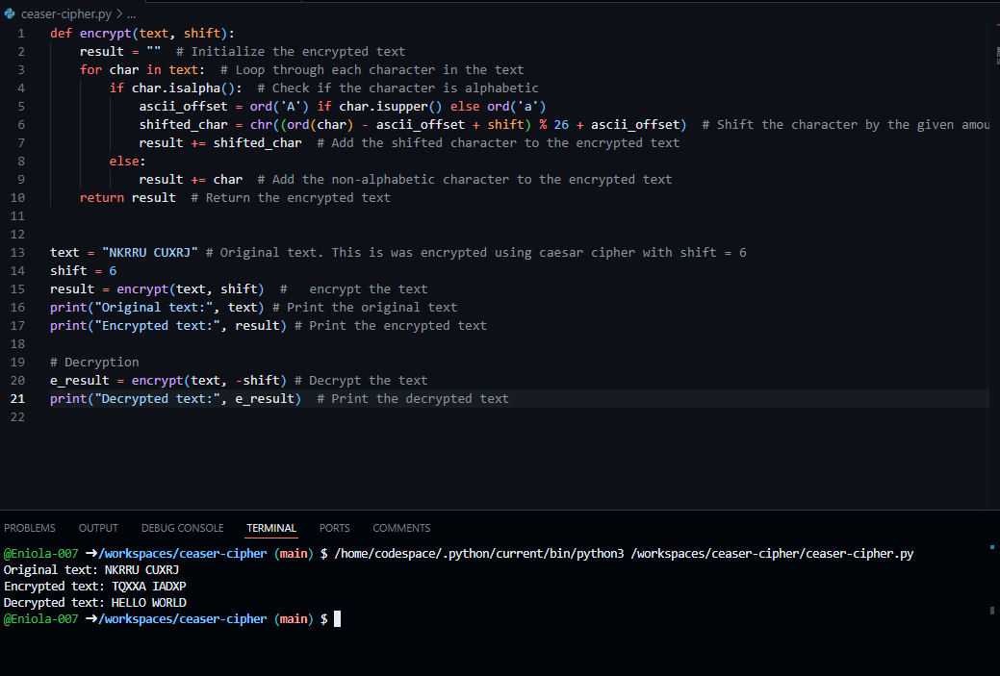

# ceaser-cipher

# Caesar Cipher Encryption and Decryption

This Excersise demonstrates a simple implementation of the Caesar Cipher for encrypting and decrypting text.

## Description

The Caesar Cipher is a type of substitution cipher in which each letter in the plaintext is shifted a certain number of places down or up the alphabet. This implementation includes both encryption and decryption functions.

## Code

```python
def encrypt(text, shift):
    result = ""  # Initialize the encrypted text
    for char in text:  # Loop through each character in the text
        if char.isalpha():  # Check if the character is alphabetic
            ascii_offset = ord('A') if char.isupper() else ord('a')
            shifted_char = chr((ord(char) - ascii_offset + shift) % 26 + ascii_offset)  # Shift the character by the given amount
            result += shifted_char  # Add the shifted character to the encrypted text
        else:
            result += char  # Add the non-alphabetic character to the encrypted text
    return result  # Return the encrypted text

# Example usage
text = "NKRRU CUXRJ"  # Original text. This was encrypted using Caesar Cipher with shift = 6
shift = 6
result = encrypt(text, shift)  # Encrypt the text
print("Original text:", text)  # Print the original text
print("Encrypted text:", result)  # Print the encrypted text

# Decryption
e_result = encrypt(text, -shift)  # Decrypt the text
print("Decrypted text:", e_result)  # Print the decrypted text
